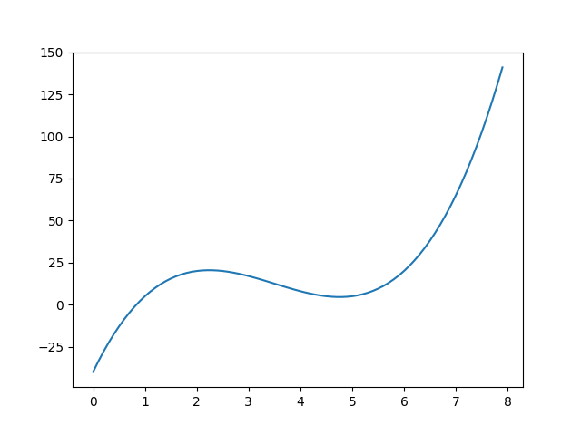

# Numerical Optimisation

## Problem

I have to find the root of a monotone increasing function that is hard to compute. My function, `f(x)` looks something like this:



The figure was generated with the following function: `f(x) = sqrt(2 * x + 3) - 3 + noise * random.random()` for `noise=0.1`.

## Local minima

We can find the minima of `|f(x)|` instead of trying to find the root. I tried one method.

### Gradient descent

This was the first approach that I tried. Gradient descent allows us to numerically find the local minima. It works by computing the gradient at `x` and updating `x` in that direction. The update for `x` is given by

```
x_{i+1} = x_i - dfdx * step;
```

where the user will choose some step size that is small. The smaller the step size, the longer it will take to converge. This approach worked in the nice case where the data was clean, but in messy data (where there are more local minima from noise) the approach failed. The code is available at [grad_dec.c](grad_dec.c).

## Root finding

My objective is to find the value of `x` that gets `f(x)` as close to `0` as possible with as few iterations as possible (since each is expensive). I didn't even bother implementing the [bisection method](https://en.wikipedia.org/wiki/Bisection_method) since it's known to take a little longer than other methods, even if it is quite robust.

### Newton's Method

Netwon's method can be used for finding roots of the function. The idea is that you can update `x` as such

```
x_{i+1} = x_i - f(x_i) / df(x_i)dx
```

until `| x_{i+1} - x_i | < threshold`, at which point you've found the closest root to the initial selection of `x`. First we need to start with a random choice for x. Let's start with `x=1.5`. To compute the derivative we'll choose some `h=0.01` can calculate the derivative for that point `dfdx=(f(x+h)-f(x))/h`. Then we can use Newton's method to find the local minima. This code is available in [newton.c](newton.c).

### Secant Method

This is a superlinear convergence method that supposedly works better that Newton's method for a good choice of starting point (but nobody really knows what that means). It works by identifying the root `x_{i+1}` of the line made by two points (`x_i`, `f(x_i)`) and (`x_{i-1}`, `f(x_{i-1})`). This process repeats until we converge on a root that is close to 0. 

```
x_{i+1} = x_i - f(x_i) * (x_i - x_{i-1}) / (f(x_i) - f(x_{i-1}));
```

This seems to work pretty well when we choose starting values for `x_{i}` and `x_{i-1}` that are not too close together. If we choose them too close together, we could get a ridiculous gradient for the line made by the two points. The code is available in [secant.c](secant.c)