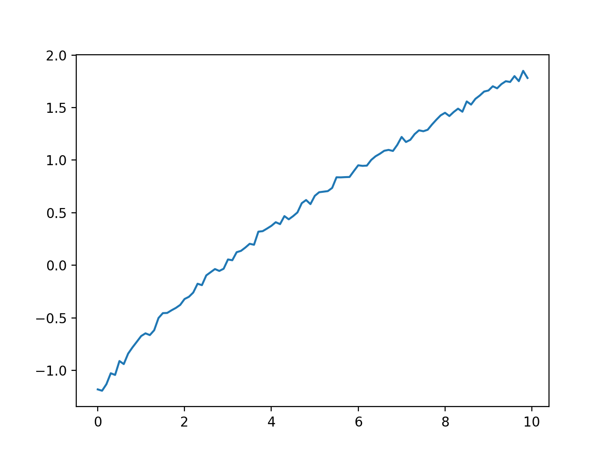

# Numerical Optimisation

## Problem

This is a playground environment that may help me solve a real problem. My real problem is I have some `f(x)` that is hard to compute (potentially resource intensive), and I want to find `x` that finds the local minima for that function. Fortunately the interval over which I have to search is relatively small. 

The function is cubic, and looks something like the curve described by the following function

```
f(x) = (x-2)(x-5)(2x-8) + 5
```

It looks like this



The local minima we're trying to find is at `x~5`.

## Root finding

Netwon's method can be used for finding roots of the function. The idea is that you can update `x` as such

```
x_{i+1} = x_i - f(x_i) / df(x_i)dx
```

until `| x_{i+1} - x_i | < threshold`, at which point you've found the closest root to the initial selection of `x`. First we need to start with a random choice for x. Let's start with `x=2.5`. To compute the derivative we'll choose some `h=0.01` can calculate the derivative for that point `dfdx=(f(x+h)-f(x))/h`. Then we can use Newton's method to find the local minima. This code is available in [run.c](run.c).

## Local minima

### Gradient descent

We can attempt to use 

### Bisection method

We can try the bisection method for some interval (which we'll have to vary to see how the global minima influences this).